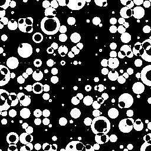

## `circles_blend.frag`

## `circles_blend_add.frag`

## `circles_blend_diff.frag`

## `circles_blend_mul.frag`

## `circles_eyes.frag`

## `circles.frag`

## Reference

- https://github.com/keijiro/ShaderSketches/blob/master/Fragment/Circles2.glsl
