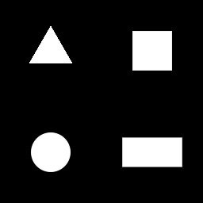
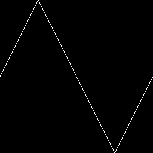
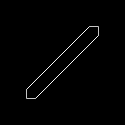

## `shapes_2d_distance_field_morphing.frag`

## `shapes_2d_distance_field.frag`

## `waves_2d_distance_field.frag`

## `lines_2d_distance_field.frag`

## Reference

- https://www.iquilezles.org/www/articles/distfunctions2d/distfunctions2d.htm
- https://qiita.com/7CIT/items/fe33b9b341b9918b6c3d
- https://qiita.com/7CIT/items/ea3b41717323c83ecc35
- https://qiita.com/7CIT/items/52ebd6421c041ac7024a
