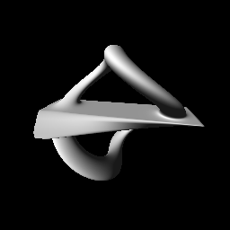
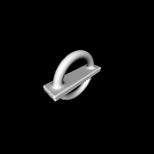

## `raymarch_primitive_twist.frag`

## `raymarch_primitive_rotate.frag`

## `raymarch_primitive_boolean.frag`

## Reference

- https://wgld.org/d/glsl/g015.html
- https://wgld.org/d/glsl/g016.html
- https://wgld.org/d/glsl/g017.html
- https://wgld.org/d/glsl/g018.html
