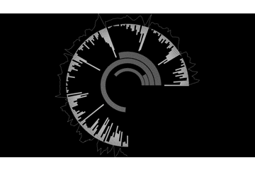

## AudioAnalysisCopyStamp (Copy SOP, Instancing, etc.)

### Copy SOP w/ stamping

- change position and some other params in each copy
- repeat path, creating sop -> some transforms -> copy in each copy (maybe)
- much slower than instancing

### instancing

- cant change the parameter which is special for SOP
- fast

## Reference

http://www.indaehwang.com/touchdesigner/sound-data-visualisation/
